```mermaid
flowchart TB
    subgraph current["DataFileReader.Tests.csproj"]
        MAIN["<b>📦&nbsp;DataFileReader.Tests.csproj</b><br/><small>net10.0</small>"]
        click MAIN "#datafilereadertestsdatafilereadertestscsproj"
    end
    subgraph downstream["Dependencies (1"]
        P1["<b>📦&nbsp;DataFileReader.csproj</b><br/><small>net10.0</small>"]
        click P1 "#datafilereaderdatafilereadercsproj"
    end
    MAIN --> P1

```

```mermaid
flowchart TB
    subgraph upstream["Dependants (2)"]
        P2["<b>📦&nbsp;DataVisualiser.csproj</b><br/><small>net10.0-windows7.0</small>"]
        P3["<b>📦&nbsp;DataFileReader.Tests.csproj</b><br/><small>net10.0</small>"]
        click P2 "#datavisualiserdatavisualisercsproj"
        click P3 "#datafilereadertestsdatafilereadertestscsproj"
    end
    subgraph current["DataFileReader.csproj"]
        MAIN["<b>📦&nbsp;DataFileReader.csproj</b><br/><small>net10.0</small>"]
        click MAIN "#datafilereaderdatafilereadercsproj"
    end
    P2 --> MAIN
    P3 --> MAIN

```

```mermaid
flowchart TB
    subgraph current["DataVisualiser.Tests.csproj"]
        MAIN["<b>📦&nbsp;DataVisualiser.Tests.csproj</b><br/><small>net10.0-windows7.0</small>"]
        click MAIN "#datavisualisertestsdatavisualisertestscsproj"
    end
    subgraph downstream["Dependencies (1"]
        P2["<b>📦&nbsp;DataVisualiser.csproj</b><br/><small>net10.0-windows7.0</small>"]
        click P2 "#datavisualiserdatavisualisercsproj"
    end
    MAIN --> P2

```

```mermaid
flowchart TB
    subgraph upstream["Dependants (1)"]
        P4["<b>📦&nbsp;DataVisualiser.Tests.csproj</b><br/><small>net10.0-windows7.0</small>"]
        click P4 "#datavisualisertestsdatavisualisertestscsproj"
    end
    subgraph current["DataVisualiser.csproj"]
        MAIN["<b>📦&nbsp;DataVisualiser.csproj</b><br/><small>net10.0-windows7.0</small>"]
        click MAIN "#datavisualiserdatavisualisercsproj"
    end
    subgraph downstream["Dependencies (1"]
        P1["<b>📦&nbsp;DataFileReader.csproj</b><br/><small>net10.0</small>"]
        click P1 "#datafilereaderdatafilereadercsproj"
    end
    P4 --> MAIN
    MAIN --> P1

```

# Projects and dependencies analysis

This document provides a comprehensive overview of the projects and their dependencies in the context of upgrading to .NETCoreApp,Version=v10.0.

## Table of Contents

- [Executive Summary](#executive-Summary)
  - [Highlevel Metrics](#highlevel-metrics)
  - [Projects Compatibility](#projects-compatibility)
  - [Package Compatibility](#package-compatibility)
  - [API Compatibility](#api-compatibility)
- [Aggregate NuGet packages details](#aggregate-nuget-packages-details)
- [Top API Migration Challenges](#top-api-migration-challenges)
  - [Technologies and Features](#technologies-and-features)
  - [Most Frequent API Issues](#most-frequent-api-issues)
- [Projects Relationship Graph](#projects-relationship-graph)
- [Project Details](#project-details)

  - [DataFileReader.Tests\DataFileReader.Tests.csproj](#datafilereadertestsdatafilereadertestscsproj)
  - [DataFileReader\DataFileReader.csproj](#datafilereaderdatafilereadercsproj)
  - [DataVisualiser.Tests\DataVisualiser.Tests.csproj](#datavisualisertestsdatavisualisertestscsproj)
  - [DataVisualiser\DataVisualiser.csproj](#datavisualiserdatavisualisercsproj)

## Executive Summary

### Highlevel Metrics

| Metric | Count | Status |
| :--- | :---: | :--- |
| Total Projects | 4 | 0 require upgrade |
| Total NuGet Packages | 19 | All compatible |
| Total Code Files | 209 |  |
| Total Code Files with Incidents | 0 |  |
| Total Lines of Code | 23792 |  |
| Total Number of Issues | 0 |  |
| Estimated LOC to modify | 0+ | at least 0.0% of codebase |

### Projects Compatibility

| Project | Target Framework | Difficulty | Package Issues | API Issues | Est. LOC Impact | Description |
| :--- | :---: | :---: | :---: | :---: | :---: | :--- |
| [DataFileReader.Tests\DataFileReader.Tests.csproj](#datafilereadertestsdatafilereadertestscsproj) | net10.0 | ✅ None | 0 | 0 |  | DotNetCoreApp, Sdk Style = True |
| [DataFileReader\DataFileReader.csproj](#datafilereaderdatafilereadercsproj) | net10.0 | ✅ None | 0 | 0 |  | DotNetCoreApp, Sdk Style = True |
| [DataVisualiser.Tests\DataVisualiser.Tests.csproj](#datavisualisertestsdatavisualisertestscsproj) | net10.0-windows7.0 | ✅ None | 0 | 0 |  | Wpf, Sdk Style = True |
| [DataVisualiser\DataVisualiser.csproj](#datavisualiserdatavisualisercsproj) | net10.0-windows7.0 | ✅ None | 0 | 0 |  | Wpf, Sdk Style = True |

### Package Compatibility

| Status | Count | Percentage |
| :--- | :---: | :---: |
| ✅ Compatible | 19 | 100.0% |
| ⚠️ Incompatible | 0 | 0.0% |
| 🔄 Upgrade Recommended | 0 | 0.0% |
| ***Total NuGet Packages*** | ***19*** | ***100%*** |

### API Compatibility

| Category | Count | Impact |
| :--- | :---: | :--- |
| 🔴 Binary Incompatible | 0 | High - Require code changes |
| 🟡 Source Incompatible | 0 | Medium - Needs re-compilation and potential conflicting API error fixing |
| 🔵 Behavioral change | 0 | Low - Behavioral changes that may require testing at runtime |
| ✅ Compatible | 0 |  |
| ***Total APIs Analyzed*** | ***0*** |  |

## Aggregate NuGet packages details

| Package | Current Version | Suggested Version | Projects | Description |
| :--- | :---: | :---: | :--- | :--- |
| Azure.Data.Tables | 12.11.0 |  | [DataFileReader.csproj](#datafilereaderdatafilereadercsproj) | ✅Compatible |
| coverlet.collector | 6.0.2 |  | [DataFileReader.Tests.csproj](#datafilereadertestsdatafilereadertestscsproj) [DataVisualiser.Tests.csproj](#datavisualisertestsdatavisualisertestscsproj) | ✅Compatible |
| CSharpMarkup.WinUI.LiveChartsCore.SkiaSharpView | 3.1.2 |  | [DataVisualiser.csproj](#datavisualiserdatavisualisercsproj) | ✅Compatible |
| Dapper | 2.1.66 |  | [DataVisualiser.csproj](#datavisualiserdatavisualisercsproj) | ✅Compatible |
| LiveCharts.Core | 0.9.8 |  | [DataVisualiser.csproj](#datavisualiserdatavisualisercsproj) | ✅Compatible |
| LiveCharts.Wpf.Core | 0.9.8 |  | [DataVisualiser.csproj](#datavisualiserdatavisualisercsproj) | ✅Compatible |
| Microsoft.Data.SqlClient | 6.1.3 |  | [DataVisualiser.csproj](#datavisualiserdatavisualisercsproj) | ✅Compatible |
| Microsoft.DependencyValidation.Analyzers | 0.11.0 |  | [DataFileReader.csproj](#datafilereaderdatafilereadercsproj) | ✅Compatible |
| Microsoft.NET.Test.Sdk | 17.12.0 |  | [DataFileReader.Tests.csproj](#datafilereadertestsdatafilereadertestscsproj) [DataVisualiser.Tests.csproj](#datavisualisertestsdatavisualisertestscsproj) | ✅Compatible |
| Moq | 4.20.72 |  | [DataVisualiser.Tests.csproj](#datavisualisertestsdatavisualisertestscsproj) | ✅Compatible |
| Newtonsoft.Json | 13.0.3 |  | [DataFileReader.csproj](#datafilereaderdatafilereadercsproj) | ✅Compatible |
| OpenAI | 2.2.0 |  | [DataFileReader.csproj](#datafilereaderdatafilereadercsproj) | ✅Compatible |
| RestClient | 3.1024.23771 |  | [DataFileReader.csproj](#datafilereaderdatafilereadercsproj) | ✅Compatible |
| RestSharp | 112.1.1-alpha.0.4 |  | [DataFileReader.csproj](#datafilereaderdatafilereadercsproj) | ✅Compatible |
| System.Configuration.ConfigurationManager | 10.0.0-preview.1.25080.5 |  | [DataFileReader.csproj](#datafilereaderdatafilereadercsproj) | ✅Compatible |
| System.Data.SqlClient | 4.9.0 |  | [DataFileReader.csproj](#datafilereaderdatafilereadercsproj) | ✅Compatible |
| System.Net.Http | 4.3.4 |  | [DataFileReader.csproj](#datafilereaderdatafilereadercsproj) | ✅Compatible |
| xunit | 2.9.2 |  | [DataFileReader.Tests.csproj](#datafilereadertestsdatafilereadertestscsproj) [DataVisualiser.Tests.csproj](#datavisualisertestsdatavisualisertestscsproj) | ✅Compatible |
| xunit.runner.visualstudio | 2.8.2 |  | [DataFileReader.Tests.csproj](#datafilereadertestsdatafilereadertestscsproj) [DataVisualiser.Tests.csproj](#datavisualisertestsdatavisualisertestscsproj) | ✅Compatible |

## Top API Migration Challenges

### Technologies and Features

| Technology | Issues | Percentage | Migration Path |
| :--- | :---: | :---: | :--- |

### Most Frequent API Issues

| API | Count | Percentage | Category |
| :--- | :---: | :---: | :--- |

## Projects Relationship Graph

Legend:
📦 SDK-style project
⚙️ Classic project

```mermaid
flowchart LR
    P1["<b>📦&nbsp;DataFileReader.csproj</b><br/><small>net10.0</small>"]
    P2["<b>📦&nbsp;DataVisualiser.csproj</b><br/><small>net10.0-windows7.0</small>"]
    P3["<b>📦&nbsp;DataFileReader.Tests.csproj</b><br/><small>net10.0</small>"]
    P4["<b>📦&nbsp;DataVisualiser.Tests.csproj</b><br/><small>net10.0-windows7.0</small>"]
    P2 --> P1
    P3 --> P1
    P4 --> P2
    click P1 "#datafilereaderdatafilereadercsproj"
    click P2 "#datavisualiserdatavisualisercsproj"
    click P3 "#datafilereadertestsdatafilereadertestscsproj"
    click P4 "#datavisualisertestsdatavisualisertestscsproj"

```

## Project Details

### DataFileReader.Tests\DataFileReader.Tests.csproj

#### Project Info

- **Current Target Framework:** net10.0✅
- **SDK-style**: True
- **Project Kind:** DotNetCoreApp
- **Dependencies**: 1
- **Dependants**: 0
- **Number of Files**: 2
- **Lines of Code**: 0
- **Estimated LOC to modify**: 0+ (at least 0.0% of the project)

#### Dependency Graph

Legend:
📦 SDK-style project
⚙️ Classic project

### API Compatibility

| Category | Count | Impact |
| :--- | :---: | :--- |
| 🔴 Binary Incompatible | 0 | High - Require code changes |
| 🟡 Source Incompatible | 0 | Medium - Needs re-compilation and potential conflicting API error fixing |
| 🔵 Behavioral change | 0 | Low - Behavioral changes that may require testing at runtime |
| ✅ Compatible | 0 |  |
| ***Total APIs Analyzed*** | ***0*** |  |

### DataFileReader\DataFileReader.csproj

#### Project Info

- **Current Target Framework:** net10.0✅
- **SDK-style**: True
- **Project Kind:** DotNetCoreApp
- **Dependencies**: 0
- **Dependants**: 2
- **Number of Files**: 50
- **Lines of Code**: 5383
- **Estimated LOC to modify**: 0+ (at least 0.0% of the project)

#### Dependency Graph

Legend:
📦 SDK-style project
⚙️ Classic project

### API Compatibility

| Category | Count | Impact |
| :--- | :---: | :--- |
| 🔴 Binary Incompatible | 0 | High - Require code changes |
| 🟡 Source Incompatible | 0 | Medium - Needs re-compilation and potential conflicting API error fixing |
| 🔵 Behavioral change | 0 | Low - Behavioral changes that may require testing at runtime |
| ✅ Compatible | 0 |  |
| ***Total APIs Analyzed*** | ***0*** |  |

### DataVisualiser.Tests\DataVisualiser.Tests.csproj

#### Project Info

- **Current Target Framework:** net10.0-windows7.0✅
- **SDK-style**: True
- **Project Kind:** Wpf
- **Dependencies**: 1
- **Dependants**: 0
- **Number of Files**: 26
- **Lines of Code**: 3340
- **Estimated LOC to modify**: 0+ (at least 0.0% of the project)

#### Dependency Graph

Legend:
📦 SDK-style project
⚙️ Classic project

### API Compatibility

| Category | Count | Impact |
| :--- | :---: | :--- |
| 🔴 Binary Incompatible | 0 | High - Require code changes |
| 🟡 Source Incompatible | 0 | Medium - Needs re-compilation and potential conflicting API error fixing |
| 🔵 Behavioral change | 0 | Low - Behavioral changes that may require testing at runtime |
| ✅ Compatible | 0 |  |
| ***Total APIs Analyzed*** | ***0*** |  |

### DataVisualiser\DataVisualiser.csproj

#### Project Info

- **Current Target Framework:** net10.0-windows7.0✅
- **SDK-style**: True
- **Project Kind:** Wpf
- **Dependencies**: 1
- **Dependants**: 1
- **Number of Files**: 135
- **Lines of Code**: 15069
- **Estimated LOC to modify**: 0+ (at least 0.0% of the project)

#### Dependency Graph

Legend:
📦 SDK-style project
⚙️ Classic project

### API Compatibility

| Category | Count | Impact |
| :--- | :---: | :--- |
| 🔴 Binary Incompatible | 0 | High - Require code changes |
| 🟡 Source Incompatible | 0 | Medium - Needs re-compilation and potential conflicting API error fixing |
| 🔵 Behavioral change | 0 | Low - Behavioral changes that may require testing at runtime |
| ✅ Compatible | 0 |  |
| ***Total APIs Analyzed*** | ***0*** |  |

