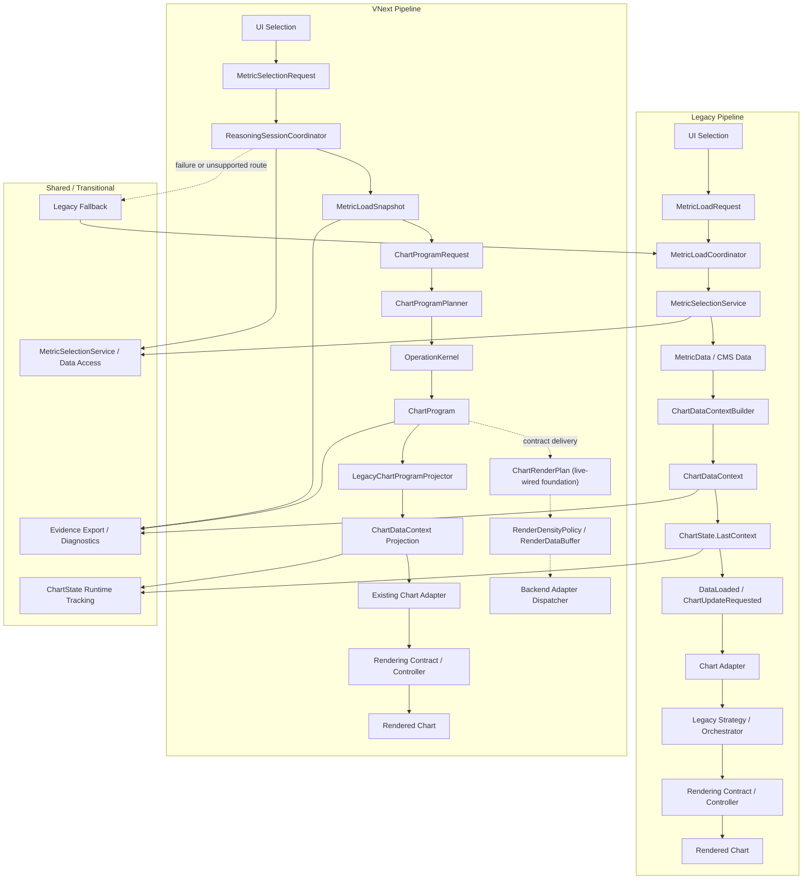
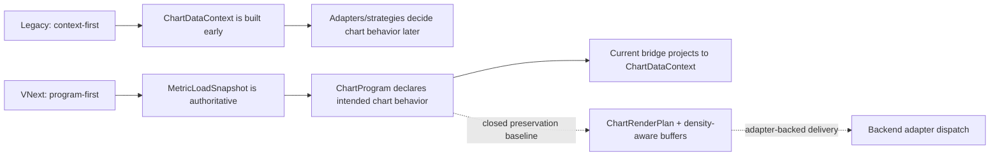

# SYSTEM MAP
**Status:** Canonical (Structural)  
**Scope:** Conceptual architecture, execution boundaries, rendering boundaries, and data-flow constraints  
**Authority:** Subordinate only to `Project Bible.md`

---

## 1. Purpose

This document defines the structural layout of the system, including:

- conceptual layers
- execution flow
- semantic authority boundaries
- rendering boundaries
- consumer and delivery boundaries
- permitted interactions between subsystems

It answers where things live, what may talk to what, and what must never cross boundaries.

The current structural reading uses the enhanced architecture containers:
- Authority / Provenance
- Reasoning / Capability
- Process / Execution
- Contract / Boundary
- Projection / Translation
- Consumer / Interaction
- Terminal Delivery
- Governance / Evidence

This is not an implementation guide.  
It is a map of allowed reality.

---

## 2. Structural Views

### 2.1 Authority Stack (Binding)

Semantic and interpretive authority flows downward only:

`Raw Data -> Normalization -> Canonical Views / CMS -> Derived Computation -> Interpretive Overlays -> Presentation`

Authority never flows upward.

---

### 2.2 Execution Stack (Structural)

Runtime execution typically passes through these operational zones:

`Consumer / Interaction -> Canonical Intent / Request Contract -> Process / Execution -> Reasoning / Capability -> Contract / Boundary -> Terminal Delivery -> Client Surface`

This execution loop does not change authority.
A UI may initiate execution, but it does not gain semantic authority by doing so.
Other consumers may do the same through explicit request contracts.

---

### 2.3 Rendering Position (Binding)

Rendering infrastructure sits below derivation and interpretation, and above concrete backend controls.

Its role is to:

- consume already-defined results or overlays
- expose qualified rendering capabilities
- isolate backend lifecycle quirks

It must never define semantics, reinterpret CMS, or compensate for missing orchestration boundaries.

### 2.4 Consumer Contract Position (Binding)

Between reasoning/program output and concrete client surfaces, the system MUST maintain consumer-agnostic downstream contracts.

These contracts:

- carry already-defined analytical output
- preserve provenance, trust class, and semantic status
- allow multiple consumer families to consume the same result without becoming semantic authorities

Consumer and presentation technologies are subordinate to these contracts.

No concrete rendering backend, chart surface, or interactive client may become the primary owner of analytical output shape merely because it is the first or most operationally convenient consumer.

Presentation is terminal and replaceable.
It may adapt and display authoritative downstream contracts, but it must not become the architectural center of the system.

### 2.5 Enhanced Container Position (Binding)

The system's forward structural shape is container-based rather than presentation-centered.

The containers are:

1. **Authority / Provenance** — owns semantic legitimacy, identity, trust status, and lineage.
2. **Reasoning / Capability** — owns reusable analytical capability, composition, transforms, comparisons, overlays, and program planning.
3. **Process / Execution** — owns workflow, sequencing, routing, fallback, and runtime observability.
4. **Contract / Boundary** — owns safe handoff, downstream constraints, and consumer-agnostic output shape.
5. **Projection / Translation** — owns translation across explicit boundaries without creating semantic meaning.
6. **Consumer / Interaction** — owns consumer adaptation, interaction semantics, local consumer state, and host coordination.
7. **Terminal Delivery** — owns rendering, backend adaptation, route/host binding, and vendor lifecycle.
8. **Governance / Evidence** — observes, validates, qualifies, audits, and proves behavior.

These containers do not reopen any historical phase.
They define the structural ownership model for active and future work.

---

## 3. Layer Definitions (Authoritative)

### 3.1 Raw Data Layer

**Responsibilities**
- ingest raw measurements
- preserve original values
- retain temporal and source fidelity

**Constraints**
- no interpretation
- no normalization
- no semantic inference

This layer is immutable.

---

### 3.2 Normalization and Canonical Identity Layer

**Responsibilities**
- assign declared semantics
- resolve metric identity
- apply deterministic normalization stages

**Constraints**
- declarative only
- ordered stages
- no statistical inference
- no downstream inspection

This is the semantic authority layer.

---

### 3.3 Canonical Interoperability / CMS Layer

**Responsibilities**
- provide the default standardized substrate for comparison and interoperability
- represent the canonical time series form for each metric
- make cross-source and cross-context comparison explicit and repeatable

**Constraints**
- immutable once produced
- semantically trustworthy within declared canonical boundaries
- never conditionally altered
- not the only downstream-accessible view

CMS is the default substrate whenever the system claims canonical comparability.

---

### 3.4 Derived Computation / Reasoning Capability Layer

**Responsibilities**
- perform declared computations over CMS
- express reusable analytical capabilities rather than feature-specific exceptions
- compose derived, comparative, confidence-aware, and interpretive outputs through explicit reasoning/program structures
- produce non-canonical results such as:
  - transforms
  - aggregates
  - compositions
  - comparative values
  - stacked values
  - chart-program or consumer-request result sets

**Constraints**
- must declare provenance
- must not mutate CMS
- results are non-authoritative by default
- result identity must remain explicit when persisted or reused

Derived results may be ephemeral or persistent, but never implicit.

Composition is an analytical responsibility here, not terminal rendering or UI builder plumbing.

The system may expose raw, normalized, canonical, or derived views downstream for explicit inspection or comparison.
Forward computation may operate on any explicitly declared downstream-safe view, provided that provenance, trust class, and semantic status remain visible and that non-canonical inputs are not misrepresented as canonical truth.
Any computation that claims canonical comparability must use CMS or another explicitly declared canonical-equivalent substrate.

---

### 3.5 Interpretive Overlay Layer

This layer provides interpretation without mutation.

It exists to help humans reason about data, not to redefine it.
Overlay definition belongs here or in reasoning/capability contracts; overlay delivery belongs in terminal rendering.

#### 3.5.1 Structural Interpretation

Includes, non-exhaustively:

- trend detection
- trend comparison
- compositional comparisons
- pivot-based or event-relative views
- dynamic colouring and emphasis
- structural or relational exploration
- system-supported conclusions: explicit recommendations for follow-up computation, filtering, or view changes derived from declared results and confidence context

**Constraints**
- no semantic promotion
- no identity inference
- no back-propagation into normalization, CMS, or derived truth

#### 3.5.2 Confidence and Reliability Overlay

**Responsibilities**
- detect statistically atypical readings
- classify variance, noise, or irregularity
- annotate, not alter, data points or interpretive views

**Permitted mechanisms**
- declared outlier detection models
- local-window variance analysis
- missingness or temporal gap detection

**Constraints**
- canonical values remain unchanged
- all confidence assessments are annotations
- all exclusions or attenuations are explicit and reversible

#### 3.5.3 Rules-Based Option Gating

The system may include declarative rules that:

- constrain UI options
- enable or disable interpretive views
- prevent invalid combinations

Rules must be:

- declarative
- explainable
- transparent to the user

Rules must never be treated as recommendations or semantic truth.

---

### 3.6 Process / Execution Layer

The process/execution layer coordinates execution, not meaning.

**Responsibilities**
- accept explicit downstream requests for result shaping, composition, or delivery
- preserve a clear separation between canonical intent, process sequencing, and reasoning/composition
- strategy selection through explicit declared mechanisms
- execution routing, including runtime-path selection between VNext and legacy load paths
- consumer-request / chart-program result composition handoff
- migration coexistence handling
- evidence/export initiation
- runtime-path tracking via explicit state (`LoadRuntimeState`) so downstream diagnostics and evidence can observe which path was used
- tab/session milestone recording for host-level evidence, including tab switches
- shared workspace load validation/clear/publish coordination for chart tabs

**Current execution paths / closed preservation baselines**
- **VNext main-chart path**: `VNextMainChartIntegrationCoordinator` → `ReasoningSessionCoordinator` → `ChartProgram` → `LegacyChartProgramProjector` → `ChartDataContext`. Route eligibility is named by `VNextChartRoutePolicy`; fresh coordinator per load. Produces signature-tracked runtime state.
- **VNext per-family path**: `VNextSeriesLoadCoordinator` → `ReasoningSessionCoordinator` → identity `ChartProgram` → `LegacyChartProgramProjector` → raw `MetricData`. Activated for Distribution, WeekdayTrend, Transform, and BarPie fresh data loads. Data resolution unified through `VNextDataResolutionHelper`. Per-family runtime tracking via `ChartState.SetFamilyRuntime(ChartProgramKind, LoadRuntimeState)`.
- **Legacy path**: `MetricLoadCoordinator` → `MetricSelectionService` → `ChartDataContextBuilder` → `ChartDataContext`. Automatic fallback on any VNext failure.
- Path selection is deterministic, visibility-based, and independent of CMS configuration.
- Legacy remains a compatibility/fallback/projection path during migration; VNext is the forward request/program model, not yet a reason to delete legacy delivery adapters.

Phase 6, Phase 6.3, and the pre-Phase-7 render-plan primer are closed historical baselines. This section describes preserved structure, not reopened phase work.

**Constraints**
- no semantic branching
- no heuristic overrides
- no hidden controller-specific execution shortcuts
- no silent bypass paths
- VNext path must not change the semantic content of the projected context relative to legacy — it is an execution-path alternative, not a semantic one

Execution reachability must be observable.

---

### 3.7 Terminal Delivery / Rendering Infrastructure Layer

This layer contains rendering contracts, backend adapters, backend probes, and qualification harnesses.
It is terminal delivery infrastructure, not a reasoning, composition, or authority layer.

**Responsibilities**
- define rendering capabilities by chart family and interaction contract
- define backend-neutral render plans and render buffers before concrete chart-library binding
- choose render density intent (`FullFidelity`, `AggregatedOverview`, `ViewportRefined`) without discarding source identity
- isolate backend-specific lifecycle, hover, animation, disposal, and visibility behavior
- host backend qualification artifacts and matrices
- translate render intent into backend-specific control behavior

**Constraints**
- chart vendors are replaceable infrastructure, not architectural authorities
- rendering contracts must not carry semantic meaning
- rendering infrastructure must not reach upward to decide computation
- backend-specific quirks must be quarantined here, not spread into orchestration or UI state
- unqualified backend slices must not be treated as production-safe
- VNext render-plan contracts must remain free of `LiveCharts`, `Syncfusion`, WPF, or other concrete backend types

**Closed VNext render-plan preservation baseline**
- `ChartRenderPlan` is the backend-neutral delivery contract over `ChartProgram`.
- `RenderDataBuffer` / `RenderDataPoint` carry chart-library-agnostic series data.
- `ChartHierarchyNodePlan` carries hierarchy-shaped delivery intent for Syncfusion/Sunburst-style and future hierarchy backends.
- `RenderDensityPolicy` and `TimeBucketRenderAggregationKernel` prepare bounded overview buffers for large ranges while preserving source counts and signatures.
- `ChartBackendCapabilities`, `ChartBackendSelector`, `IChartRenderPlanAdapter<TSurface>`, and `ChartRenderPlanAdapterDispatcher<TSurface>` define the backend negotiation and adapter seam.
- This foundation is closed as the pre-Phase-7 preservation baseline: the active UI surfaces render through adapter-backed `ChartRenderPlan` delivery, while remaining legacy paths continue to exist where compatibility or projection is still required.

---

### 3.8 Consumer / Interaction Layer

The consumer/interaction layer is a downstream boundary.
Presentation/UI is one consumer family inside this layer.
It adapts outputs from lower layers, exposes explicit user controls, and expresses interaction through contracts.

**Responsibilities**
- host graph parent controllers and chart surfaces
- support chart, export, API, and future consumer families
- expose configuration, interpretation, and visibility choices
- represent interaction semantics without redefining semantic meaning
- visualize provenance, uncertainty, qualification state, and result-set state
- converge toward standardized graph hosts where capability semantics genuinely align
- serve as one family of downstream clients rather than the architectural center of the system

**Constraints**
- must not infer semantics
- must not hide uncertainty
- must not compensate for missing computation or rendering boundaries
- controller standardization must not turn the UI into a semantic authority
- must remain replaceable without requiring semantic or orchestration redesign
- must not become the primary home of result composition, reasoning, or execution routing

UI is expressive, not authoritative.
Charts are one consumer family, not the definition of the platform.
Interaction is not merely event wiring; it is downstream behavior constrained by contracts.

---

## 4. Analytical Programs, Chart Programs, and Programmable Composition

The system's reasoning engine produces analytical programs — explicit, inspectable, composable descriptions of what to compute and how to deliver it. Chart programs are the chart-oriented specialization of this broader model; non-chart consumers (reports, APIs, exports, future clients) may consume the same analytical programs through different delivery contracts.

This capability remains structurally downstream of truth assignment and canonicalization. Programs do not define meaning; they compose and deliver it.

### 4.1 Analytical / Chart Program Definition

An analytical or chart program is an explicit downstream construct that may include:

- selected metrics or submetrics
- explicit source-view selection where permitted by upstream boundaries
- declared unary, binary, ternary, or higher-order operations
- filters, windowing, or contextual selection instructions
- render intent for one or more derived result sets
- optional interpretive overlays
- client-facing output constraints or delivery hints

### 4.2 Structural Placement

Chart programs sit across:

- derived computation, for declared result construction
- interpretive overlays, for non-authoritative overlay behavior
- canonical intent / request contracts, for output selection and result-shape intent
- process/execution, for explicit execution handoff
- contract/boundary seams, for downstream-safe result and interaction shape
- consumer/interaction layers, for user-facing adaptation and control
- terminal delivery infrastructure, for backend-safe display or transport

### 4.3 Binding Constraints

Chart programs:

- do not assign meaning
- do not alter CMS
- do not promote results into canonical truth implicitly
- must preserve provenance for each result set
- may use only qualified rendering capability slices for the interactions they need
- must not bypass declared authority boundaries merely because a caller requests lower-level data access

Programmability is a downstream capability, not a semantic one.

---

## 5. Execution Boundaries and Flow Rules

### 5.1 Directionality Rule (Binding)

Authority and permitted dependency direction follow:

`Truth -> Reasoning/Derivation -> Interpretation -> Process -> Contracts -> Consumers -> Terminal Delivery`

Upward semantic influence is forbidden.

### 5.2 Allowed Consumption

- explicit consumers may request raw, normalized, canonical, or derived views only through declared boundaries with visible provenance and no semantic promotion
- orchestration may consume declared strategies, derived results, overlay intent, and rendering contracts
- contract/boundary seams may carry downstream-safe program, delivery, view, interaction, and multi-result shapes
- consumer/interaction layers may consume downstream-safe outputs and state needed to adapt and interact
- terminal delivery infrastructure may consume derived results, overlays, and delivery contracts
- non-UI consumers may consume the same downstream-safe result contracts without becoming semantic authorities

### 5.3 Prohibited Boundary Violations

Examples include:

- UI selecting semantic meaning
- caller access silently bypassing canonical boundaries
- confidence logic modifying CMS
- trend logic influencing normalization
- rendering logic altering computation
- backend lifecycle quirks driving orchestration design
- controller-specific assumptions redefining a chart family's architectural contract

Such violations constitute architectural breach.

---

## 6. Migration and Evidence Boundaries

### 6.1 Migration Coexistence Model

During migration phases, the system may contain:

- legacy execution paths
- CMS-based execution paths

**Constraints**
- canonical, provenance-visible execution is the forward path
- CMS-capable execution remains the default interoperability path
- legacy is compatibility-only
- parity visibility is mandatory
- unreachable code is treated as non-existent

Migration is a state, not a feature.

Closed migration work remains a preservation baseline. New progress must not be tracked as reopened Phase 5, Phase 6, Phase 6.3, or pre-Phase-7 primer work.

### 6.2 Reachability and Evidence

Evidence generation is structurally downstream of execution.
It is a governance/evidence sidecar: it observes and proves behavior, but does not govern live semantic control.

It may observe:

- which strategy ran
- which execution path was used (VNext or legacy, via `LoadRuntimeState`)
- request/snapshot/program/projected-context signature alignment
- parity outcomes
- backend qualification outcomes
- export scope (`Charts` or `Syncfusion`) and session milestones, including tab switches

Evidence infrastructure currently lives in `UI/MainHost/Evidence/` and is decomposed into:
- `EvidenceExportModels` — standalone DTOs for parity snapshots, diagnostics, and VNext runtime state
- `EvidenceDiagnosticsBuilder` — assembles diagnostic state from chart state, metric state, and runtime path
- `EvidenceDataResolutionHelper` — shared context-series resolution and strategy cut-over resolution
- `MainChartsEvidenceExportService` — orchestrates parity evaluation and JSON export

The same `MainChartsEvidenceExportService` is used for both Charts and Syncfusion tab scopes; `ExportScope` distinguishes the source surface in the JSON payload.

Strategy migration decisions are separated from parity validation: `StrategyCmsDecisionEvaluator` owns CMS eligibility decisions, while `StrategyParityValidationService` owns strategy-type inference, parity harness selection, and fallback parity validation. `StrategyCutOverService` remains the creation/reachability facade.
Parity series comparison is centralized through `ParitySeriesComparer`, so parity harnesses adapt source data and delegate tolerance, NaN, failure, and strict-mode behavior to one validation primitive.

Reachability export infrastructure lives in `UI/MainHost/Export/`. Host coordination lives in `UI/MainHost/Coordination/`.

The Charts and Syncfusion tabs both use `ChartTabHost` for the chart-specific tab shell and `MetricSelectionPanel` for the shared metric-selection/date/CMS control surface, while each host supplies its own chart content. `ChartTabHost` composes the generic `WorkspaceTabHost`, which provides header/body slots without metric-specific assumptions. `AdminMetricsManagerView` also uses `WorkspaceTabHost` directly with Admin-specific header controls, so Admin aligns with the shared workspace shell without adopting chart-specific metric-selection controls. Admin row loading, dirty tracking, save state, filtering, and milestone recording are coordinated by `AdminMetricsManagerCoordinator` behind `IAdminMetricsRepository`. Main and Syncfusion host busy lifetimes share `UiBusyScopeLease`. Main and Syncfusion load validation, load/reset handling, failed-load clearing, successful publish, and clear behavior delegate through `WorkspaceLoadCoordinator`. Metric-selection event forwarding is centralized through `MetricSelectionPanelEventBinder`. Ordinary session milestone snapshot construction delegates through `WorkspaceSessionMilestoneRecorder`; host-specific wrappers remain free to add tab-specific semantics. Theme-toggle, reset-zoom, Admin management actions, and Syncfusion load/render/export actions emit explicit session milestones for evidence exports.

Tooltip rendering text is exposed through `ChartTooltipFormattingHelper`, which is a facade over focused pair, stacked, cumulative, title-parsing, value-formatting, and overlay-filter helpers. Tooltip helpers remain rendering infrastructure and must not define metric semantics.

It must not influence live semantic decisions.

---

## 7. Rendering and Backend Qualification Rules

### 7.1 Capability-Oriented Terminal Delivery

Rendering must be defined by capability family rather than vendor control type.
Capability qualification may prove delivery safety, but it does not create semantic authority.

Examples include:

- time-series/cartesian
- distribution/range
- polar/radar-style projection
- compositional/hierarchical
- transform/result
- hover/selection/legend/visibility/reset interactions

### 7.2 Backend Qualification Requirement

No backend may be treated as production-safe for a capability family until it has passed explicit qualification for that slice.

Qualification may include:

- initial render
- repeated updates
- hide/show behavior
- tab switch or offscreen behavior
- unload/disposal
- application close
- hover and tooltip interaction

### 7.3 Tactical Stabilization Rule

Tactical fallbacks may preserve capability temporarily, but do not count as architectural closure or backend qualification.

---

## 8. Language and Signalling Constraints

All layers above CMS must communicate uncertainty clearly.

**Avoid**
- "invalid data"
- "wrong reading"
- "bad value"

**Prefer**
- "statistically atypical"
- "low confidence under selected model"
- "excluded from trend overlay"
- "qualified only for selected capability slice"

Language is part of architecture.

---

## 9. Summary

- truth layers are preserved and canonical meaning is stable
- authority and provenance remain explicit upstream responsibilities
- the reasoning engine is the capability and composition center; it produces analytical programs that delivery surfaces consume
- derivation is explicit and provenance-preserving
- confidence and provenance are integral to every result, not optional annotations
- interpretation is powerful but bounded
- downstream requests may be rich and composable without becoming semantic authorities
- orchestration coordinates execution but does not define meaning
- contract/boundary seams are the downstream fan-out point
- rendering and delivery infrastructure are terminal, replaceable, and qualification-bound
- UI is expressive but non-authoritative
- charts are one consumer family among several possible clients
- non-chart consumers may consume the same analytical programs through different delivery contracts
- programmable composition is allowed only as a downstream, reversible, provenance-visible capability

This map defines what the system is allowed to be.

---

## Appendix A. DataVisualiser Presentation Pipeline Spine (Descriptive)

This appendix describes the primary path from "user loads metrics" to "charts refresh" in the DataVisualiser subsystem, without claiming all code fits this model. It is descriptive, not authoritative — the layer definitions and boundary rules above govern. It describes the current preserved shape and does not reopen closed Phase 6 or pre-Phase-7 work.

### A.1 Ordered Stages (Happy Path)

1. **UI validation** — Selection + date range; `MainWindowViewModel.ValidateDataLoadRequirements` / view guards.
2. **Load metrics into context** — `MainWindowViewModel.LoadMetricDataAsync` → `MetricLoadCoordinator.LoadMetricDataAsync`:
   - **VNext main-chart path** (when only Main chart visible): `VNextMainChartIntegrationCoordinator` → fresh `ReasoningSessionCoordinator` → `LoadAsync` → `BuildMainProgram` → `LegacyChartProgramProjector.ProjectToChartContext` → `ChartState.LastContext`. Runtime tracked via `ChartState.LastLoadRuntime` (`EvidenceRuntimePath.VNextMain`).
   - **VNext per-family path** (for Distribution, WeekdayTrend, Transform, BarPie fresh data loads): `VNextDataResolutionHelper` → `VNextSeriesLoadCoordinator` → fresh `ReasoningSessionCoordinator` → identity `ChartProgram` → projected `MetricData`. Runtime tracked via `ChartState.SetFamilyRuntime(ChartProgramKind, ...)`.
   - **Legacy path** (automatic fallback on VNext failure): `MetricSelectionService.LoadMetricDataWithCmsAsync` → `ChartDataContextBuilder.Build` → `ChartState.LastContext`. Runtime tracked via `ChartState.LastLoadRuntime` (`EvidenceRuntimePath.Legacy`).
3. **Publish + schedule chart work** — `LoadDataCommand` → `LoadData()` raises `DataLoaded` and calls `RequestChartUpdate()`. Facade: `ChartPresentationSpine.PublishLastContextAndRequestChartUpdate`.
4. **Composition of engines** — `MainChartsViewChartPipelineFactory` builds `ChartUpdateCoordinator`, `ChartRenderingOrchestrator`, distribution services, etc.
5. **Per-chart orchestration** — `ChartRenderingOrchestrator` / `*OrchestrationPipeline` / `ChartUpdateCoordinator` drive prep and render for each chart family.

### A.2 Key Types (Navigation)

| Stage | Types |
|--------|--------|
| Load + context (VNext main) | `VNextMainChartIntegrationCoordinator`, `ReasoningSessionCoordinator`, `LegacyChartProgramProjector` |
| Load + context (VNext per-family) | `VNextDataResolutionHelper`, `VNextSeriesLoadCoordinator`, `ReasoningSessionCoordinator` |
| VNext main-family route policy | `VNextChartRoutePolicy` |
| Load + context (Legacy) | `MetricLoadCoordinator`, `MetricSelectionService`, `ChartDataContextBuilder` |
| Runtime state | `ChartState.LastLoadRuntime`, `ChartState.FamilyLoadRuntimes` (`Dictionary<ChartProgramKind, LoadRuntimeState>`), `EvidenceRuntimePath` |
| VM seam | `MainWindowViewModel` (`LoadMetricDataAsync`, `LoadDataCommand`, `RequestChartUpdate`) |
| Workspace load coordination | `WorkspaceLoadCoordinator` and its `LoadValidationInput`, `ValidationActions`, `LoadExecutionActions`, `ClearActions` records |
| Factory | `MainChartsViewChartPipelineFactory`, `MainChartsViewChartPipelineFactoryResult` |
| Render | `ChartRenderingOrchestrator`, `ChartUpdateCoordinator` |
| VNext render-plan preservation baseline | `ChartRenderPlan`, `ChartRenderPlanProjector`, `RenderDensityPolicy`, `TimeBucketRenderAggregationKernel`, `ChartBackendCapabilities`, `ChartRenderPlanAdapterDispatcher<TSurface>` |
| Evidence | `EvidenceExportModels`, `EvidenceDiagnosticsBuilder`, `EvidenceDataResolutionHelper`, `MainChartsEvidenceExportService` (all in `UI/MainHost/Evidence/`) |

### A.3 VNext Routing Decision

**Main-chart family routing** lives in `VNextChartRoutePolicy`, invoked by `MetricLoadCoordinator`. It evaluates `ChartState` visibility flags directly:
- VNext main-chart path activates when `IsMainVisible == true` and all extended charts (`Distribution`, `WeeklyTrend`, `Transform`, `BarPie`) are hidden.
- `Normalized` and `Diff/Ratio` may consume the main-family projected context, but `SupportsOnlyMainChart` remains false when either is visible.
- Legacy activates otherwise, or as automatic fallback on VNext failure.

**Per-family routing** is embedded in each adapter's data resolution path:
- Distribution: `DistributionChartControllerAdapter` → `VNextDataResolutionHelper` → `VNextSeriesLoadCoordinator`
- WeekdayTrend: `WeekdayTrendChartControllerAdapter.LoadFreshWeekdayTrendDataAsync` → `VNextSeriesLoadCoordinator`
- Transform: `TransformDataResolutionCoordinator.LoadFreshTransformDataAsync` → `VNextSeriesLoadCoordinator`
- BarPie: `BarPieRenderModelBuilder.LoadSeriesTotalsAsync` → `VNextSeriesLoadCoordinator` (per-series, parallel)
- Each fires when a fresh load is needed (selected series differs from main context primary/secondary) and falls back to legacy on failure.

All routing is independent of CMS configuration.

### A.4 Legacy / Parallel Paths (Not the Spine)

- **Syncfusion host** — Own view and render path; still uses the same VM load + `LoadDataCommand` sequence where wired. Clears `LastLoadRuntime` on reset paths.
- **Ad-hoc reloads** — Several adapters call `MetricSelectionService.LoadMetricDataAsync` directly for a subset of charts; spine remains "full context load" above.
- **DataFileReader ingest** — Separate CLI pipeline (files → DB); meets the app at storage, not at `ChartState`.

Syncfusion exports through the shared evidence service with `ExportScope = "Syncfusion"` rather than a tab-specific stub.

### A.5 Code Facade

`DataVisualiser.UI.ChartPresentationSpine` (`UI/ChartPresentationSpine.cs`) — thin forwards to the VM for stages 2–3 so the spine has a single type to open first.

---

## Appendix B. Legacy and VNext Rendering Pipeline Comparison

This directed view describes the active migration shape. Legacy remains a compatibility and fallback path; VNext is the forward request/program model.

---

**End of SYSTEM MAP**
