# Type Dependency Diagram

Generated: 2026-05-02 09:25:18
Root: C:\Development\POCs\DataAnalyser

This file is auto-generated.
It reflects direct textual references between declared repository C# types.
No compiler binding. No inference. No semantic interpretation.

------------------------------------------------------

## Summary

- Declared type symbols: 1013
- Direct type-reference edges: 7575
- Dependency-density reading: 0.7389%
- Private declarations included: False

------------------------------------------------------

## Mermaid Diagram

```mermaid
graph TD
  Actions["Actions"] --> ChartControllerKeys["ChartControllerKeys"]
  Actions["Actions"] --> ChartDataContext["ChartDataContext"]
  Actions["Actions"] --> ChartState["ChartState"]
  Actions["Actions"] --> Context["Context"]
  Actions["Actions"] --> MainWindowViewModel["MainWindowViewModel"]
  Actions["Actions"] --> MetricNameOption["MetricNameOption"]
  Actions["Actions"] --> MetricSeriesSelection["MetricSeriesSelection"]
  Actions["Actions"] --> MetricState["MetricState"]
  Actions["Actions"] --> Result["Result"]
  AdminMetricsManagerCoordinatorTests["AdminMetricsManagerCoordinatorTests"] --> Result["Result"]
  AdminMetricsManagerView["AdminMetricsManagerView"] --> Result["Result"]
  AdminSessionMilestoneRecorder["AdminSessionMilestoneRecorder"] --> ChartState["ChartState"]
  AdminSessionMilestoneRecorder["AdminSessionMilestoneRecorder"] --> Context["Context"]
  AdminSessionMilestoneRecorder["AdminSessionMilestoneRecorder"] --> MetricState["MetricState"]
  AdminSessionMilestoneRecorderTests["AdminSessionMilestoneRecorderTests"] --> ChartState["ChartState"]
  AdminSessionMilestoneRecorderTests["AdminSessionMilestoneRecorderTests"] --> Context["Context"]
  AdminSessionMilestoneRecorderTests["AdminSessionMilestoneRecorderTests"] --> MainWindowViewModel["MainWindowViewModel"]
  AdminSessionMilestoneRecorderTests["AdminSessionMilestoneRecorderTests"] --> MetricData["MetricData"]
  AdminSessionMilestoneRecorderTests["AdminSessionMilestoneRecorderTests"] --> MetricNameOption["MetricNameOption"]
  AdminSessionMilestoneRecorderTests["AdminSessionMilestoneRecorderTests"] --> MetricSelectionService["MetricSelectionService"]
  AdminSessionMilestoneRecorderTests["AdminSessionMilestoneRecorderTests"] --> MetricSeriesSelection["MetricSeriesSelection"]
  AdminSessionMilestoneRecorderTests["AdminSessionMilestoneRecorderTests"] --> MetricState["MetricState"]
  AlignedMetricSeries["AlignedMetricSeries"] --> MetricData["MetricData"]
  AlignedMetricSeries["AlignedMetricSeries"] --> Result["Result"]
  AlignedSeriesBundle["AlignedSeriesBundle"] --> MetricData["MetricData"]
  AlignedSeriesBundle["AlignedSeriesBundle"] --> Result["Result"]
  AlignmentMode["AlignmentMode"] --> MetricData["MetricData"]
  AlignmentMode["AlignmentMode"] --> Result["Result"]
  AnalyticalConsumerDeliveryResult["AnalyticalConsumerDeliveryResult"] --> ChartProgramKind["ChartProgramKind"]
  AnalyticalConsumerDeliveryResult["AnalyticalConsumerDeliveryResult"] --> ChartProgramRequest["ChartProgramRequest"]
  AnalyticalConsumerDeliveryResult["AnalyticalConsumerDeliveryResult"] --> CompositionKind["CompositionKind"]
  AnalyticalConsumerDeliveryResult["AnalyticalConsumerDeliveryResult"] --> ConsumerDeliveryContract["ConsumerDeliveryContract"]
  AnalyticalConsumerDeliveryResult["AnalyticalConsumerDeliveryResult"] --> ConsumerKind["ConsumerKind"]
  AnalyticalConsumerDeliveryResult["AnalyticalConsumerDeliveryResult"] --> MetaData["MetaData"]
  AnalyticalConsumerDeliveryResult["AnalyticalConsumerDeliveryResult"] --> MetricSelectionRequest["MetricSelectionRequest"]
  AnalyticalConsumerDeliveryResult["AnalyticalConsumerDeliveryResult"] --> SeriesOperationRequest["SeriesOperationRequest"]
  AnalyticalExecutionResult["AnalyticalExecutionResult"] --> Program["Program"]
  AnalyticalIntent["AnalyticalIntent"] --> CapabilityRequest["CapabilityRequest"]
  AnalyticalIntent["AnalyticalIntent"] --> ChartProgramDeliveryTargetResolver["ChartProgramDeliveryTargetResolver"]
  AnalyticalIntent["AnalyticalIntent"] --> ChartProgramRequest["ChartProgramRequest"]
  AnalyticalIntent["AnalyticalIntent"] --> ConsumerDeliveryContract["ConsumerDeliveryContract"]
  AnalyticalIntent["AnalyticalIntent"] --> MetricSelectionRequest["MetricSelectionRequest"]
  AnalyticalIntentContractsTests["AnalyticalIntentContractsTests"] --> CapabilityRequest["CapabilityRequest"]
  AnalyticalIntentContractsTests["AnalyticalIntentContractsTests"] --> ChartDisplayMode["ChartDisplayMode"]
  AnalyticalIntentContractsTests["AnalyticalIntentContractsTests"] --> ChartHierarchyNodePlan["ChartHierarchyNodePlan"]
  AnalyticalIntentContractsTests["AnalyticalIntentContractsTests"] --> ChartProgramDeliveryTargetResolver["ChartProgramDeliveryTargetResolver"]
  AnalyticalIntentContractsTests["AnalyticalIntentContractsTests"] --> ChartProgramKind["ChartProgramKind"]
  AnalyticalIntentContractsTests["AnalyticalIntentContractsTests"] --> ChartProgramRequest["ChartProgramRequest"]
  AnalyticalIntentContractsTests["AnalyticalIntentContractsTests"] --> ChartRenderPlanKind["ChartRenderPlanKind"]
  AnalyticalIntentContractsTests["AnalyticalIntentContractsTests"] --> ChartRenderPlanMetadataKeys["ChartRenderPlanMetadataKeys"]
  AnalyticalIntentContractsTests["AnalyticalIntentContractsTests"] --> ChartRenderPlanVocabularyMetadata["ChartRenderPlanVocabularyMetadata"]
  AnalyticalIntentContractsTests["AnalyticalIntentContractsTests"] --> CompositionKind["CompositionKind"]
  AnalyticalIntentContractsTests["AnalyticalIntentContractsTests"] --> ConsumerDeliveryContract["ConsumerDeliveryContract"]
  AnalyticalIntentContractsTests["AnalyticalIntentContractsTests"] --> ConsumerKind["ConsumerKind"]
  AnalyticalIntentContractsTests["AnalyticalIntentContractsTests"] --> MetaData["MetaData"]
  AnalyticalIntentContractsTests["AnalyticalIntentContractsTests"] --> MetricData["MetricData"]
  AnalyticalIntentContractsTests["AnalyticalIntentContractsTests"] --> MetricSelectionRequest["MetricSelectionRequest"]
  AnalyticalIntentContractsTests["AnalyticalIntentContractsTests"] --> Program["Program"]
  AnalyticalIntentContractsTests["AnalyticalIntentContractsTests"] --> Result["Result"]
  AnalyticalIntentFactory["AnalyticalIntentFactory"] --> CapabilityRequest["CapabilityRequest"]
  AnalyticalIntentFactory["AnalyticalIntentFactory"] --> ChartDisplayMode["ChartDisplayMode"]
  AnalyticalIntentFactory["AnalyticalIntentFactory"] --> ChartProgramDeliveryTargetResolver["ChartProgramDeliveryTargetResolver"]
  AnalyticalIntentFactory["AnalyticalIntentFactory"] --> ChartProgramKind["ChartProgramKind"]
  AnalyticalIntentFactory["AnalyticalIntentFactory"] --> ChartProgramRequest["ChartProgramRequest"]
  AnalyticalIntentFactory["AnalyticalIntentFactory"] --> ConsumerDeliveryContract["ConsumerDeliveryContract"]
  AnalyticalIntentFactory["AnalyticalIntentFactory"] --> MetricSelectionRequest["MetricSelectionRequest"]
  AnalyticalIntentFactory["AnalyticalIntentFactory"] --> SeriesOperationRequest["SeriesOperationRequest"]
  AnalyticalIntentFactoryTests["AnalyticalIntentFactoryTests"] --> ChartDisplayMode["ChartDisplayMode"]
  AnalyticalIntentFactoryTests["AnalyticalIntentFactoryTests"] --> ChartProgramKind["ChartProgramKind"]
  AnalyticalIntentFactoryTests["AnalyticalIntentFactoryTests"] --> CompositionKind["CompositionKind"]
  AnalyticalIntentFactoryTests["AnalyticalIntentFactoryTests"] --> ConsumerKind["ConsumerKind"]
  AnalyticalIntentFactoryTests["AnalyticalIntentFactoryTests"] --> MetricSelectionRequest["MetricSelectionRequest"]
  AnalyticalIntentFactoryTests["AnalyticalIntentFactoryTests"] --> SeriesOperationRequest["SeriesOperationRequest"]
  AnalyticalIntentSet["AnalyticalIntentSet"] --> ChartProgramKind["ChartProgramKind"]
  AnalyticalIntentSet["AnalyticalIntentSet"] --> MetricSelectionRequest["MetricSelectionRequest"]
  AnalyticalInterpretationBuilder["AnalyticalInterpretationBuilder"] --> Program["Program"]
  AnalyticalInterpretationBuilder["AnalyticalInterpretationBuilder"] --> Result["Result"]
  AnalyticalInterpretationBuilderTests["AnalyticalInterpretationBuilderTests"] --> ChartDisplayMode["ChartDisplayMode"]
  AnalyticalInterpretationBuilderTests["AnalyticalInterpretationBuilderTests"] --> ChartProgramKind["ChartProgramKind"]
  AnalyticalInterpretationBuilderTests["AnalyticalInterpretationBuilderTests"] --> ChartProgramRequest["ChartProgramRequest"]
  AnalyticalInterpretationBuilderTests["AnalyticalInterpretationBuilderTests"] --> MetricData["MetricData"]
  AnalyticalInterpretationBuilderTests["AnalyticalInterpretationBuilderTests"] --> MetricSelectionRequest["MetricSelectionRequest"]
  AnalyticalInterpretationBuilderTests["AnalyticalInterpretationBuilderTests"] --> Program["Program"]
  AnalyticalInterpretationBuilderTests["AnalyticalInterpretationBuilderTests"] --> Result["Result"]
  AnalyticalRenderPlanPipeline["AnalyticalRenderPlanPipeline"] --> ChartHierarchyNodePlan["ChartHierarchyNodePlan"]
  AnalyticalRenderPlanPipeline["AnalyticalRenderPlanPipeline"] --> ChartRenderPlan["ChartRenderPlan"]
  AnalyticalRenderPlanPipeline["AnalyticalRenderPlanPipeline"] --> ChartRenderPlanKind["ChartRenderPlanKind"]
  AnalyticalRenderPlanPipeline["AnalyticalRenderPlanPipeline"] --> MetaData["MetaData"]
  AnalyticalRenderPlanPipeline["AnalyticalRenderPlanPipeline"] --> Program["Program"]
  AnalyticalRenderPlanPipelineTests["AnalyticalRenderPlanPipelineTests"] --> ChartHierarchyNodePlan["ChartHierarchyNodePlan"]
  AnalyticalRenderPlanPipelineTests["AnalyticalRenderPlanPipelineTests"] --> ChartProgramKind["ChartProgramKind"]
  AnalyticalRenderPlanPipelineTests["AnalyticalRenderPlanPipelineTests"] --> ChartProgramRequest["ChartProgramRequest"]
  AnalyticalRenderPlanPipelineTests["AnalyticalRenderPlanPipelineTests"] --> ChartRenderDensityMode["ChartRenderDensityMode"]
  AnalyticalRenderPlanPipelineTests["AnalyticalRenderPlanPipelineTests"] --> ChartRenderPlanKind["ChartRenderPlanKind"]
  AnalyticalRenderPlanPipelineTests["AnalyticalRenderPlanPipelineTests"] --> ChartRenderPlanMetadataKeys["ChartRenderPlanMetadataKeys"]
  AnalyticalRenderPlanPipelineTests["AnalyticalRenderPlanPipelineTests"] --> CompositionKind["CompositionKind"]
  AnalyticalRenderPlanPipelineTests["AnalyticalRenderPlanPipelineTests"] --> ConsumerDeliveryContract["ConsumerDeliveryContract"]
  AnalyticalRenderPlanPipelineTests["AnalyticalRenderPlanPipelineTests"] --> ConsumerKind["ConsumerKind"]
  AnalyticalRenderPlanPipelineTests["AnalyticalRenderPlanPipelineTests"] --> ConsumerProviderContracts["ConsumerProviderContracts"]
  AnalyticalRenderPlanPipelineTests["AnalyticalRenderPlanPipelineTests"] --> MetaData["MetaData"]
  AnalyticalRenderPlanPipelineTests["AnalyticalRenderPlanPipelineTests"] --> MetricData["MetricData"]
  AnalyticalRenderPlanPipelineTests["AnalyticalRenderPlanPipelineTests"] --> MetricSelectionRequest["MetricSelectionRequest"]
  AnalyticalRenderPlanPipelineTests["AnalyticalRenderPlanPipelineTests"] --> Program["Program"]
  AnalyticalRenderPlanPipelineTests["AnalyticalRenderPlanPipelineTests"] --> Result["Result"]
  AnalyticalRenderPlanResult["AnalyticalRenderPlanResult"] --> ChartHierarchyNodePlan["ChartHierarchyNodePlan"]
  AnalyticalRenderPlanResult["AnalyticalRenderPlanResult"] --> ChartRenderPlan["ChartRenderPlan"]
  AnalyticalRenderPlanResult["AnalyticalRenderPlanResult"] --> ChartRenderPlanKind["ChartRenderPlanKind"]
  AnalyticalRenderPlanResult["AnalyticalRenderPlanResult"] --> MetaData["MetaData"]
  AnalyticalRenderPlanResult["AnalyticalRenderPlanResult"] --> Program["Program"]
  AnalyticalRenderPlanSetResult["AnalyticalRenderPlanSetResult"] --> ChartHierarchyNodePlan["ChartHierarchyNodePlan"]
  AnalyticalRenderPlanSetResult["AnalyticalRenderPlanSetResult"] --> ChartRenderPlan["ChartRenderPlan"]
  AnalyticalRenderPlanSetResult["AnalyticalRenderPlanSetResult"] --> ChartRenderPlanKind["ChartRenderPlanKind"]
  AnalyticalRenderPlanSetResult["AnalyticalRenderPlanSetResult"] --> MetaData["MetaData"]
  AnalyticalRenderPlanSetResult["AnalyticalRenderPlanSetResult"] --> Program["Program"]
  AnalyticalResultSet["AnalyticalResultSet"] --> ChartProgramKind["ChartProgramKind"]
  AnalyticalResultSet["AnalyticalResultSet"] --> MetricSelectionRequest["MetricSelectionRequest"]
  AnalyticalResultSet["AnalyticalResultSet"] --> Program["Program"]
  AnalyticalResultSet["AnalyticalResultSet"] --> Result["Result"]
  AppThemeServiceTests["AppThemeServiceTests"] --> StaTestHelper["StaTestHelper"]
  BarPieBackendKey["BarPieBackendKey"] --> CapabilityRequest["CapabilityRequest"]
  BarPieBackendKey["BarPieBackendKey"] --> ChartDisplayMode["ChartDisplayMode"]
  BarPieBackendKey["BarPieBackendKey"] --> ChartHierarchyNodePlan["ChartHierarchyNodePlan"]
  BarPieBackendKey["BarPieBackendKey"] --> ChartInteractionPlan["ChartInteractionPlan"]
  BarPieBackendKey["BarPieBackendKey"] --> ChartProgramKind["ChartProgramKind"]
  BarPieBackendKey["BarPieBackendKey"] --> ChartProgramRequest["ChartProgramRequest"]
  BarPieBackendKey["BarPieBackendKey"] --> ChartRenderDensityMode["ChartRenderDensityMode"]
  BarPieBackendKey["BarPieBackendKey"] --> ChartRenderPlan["ChartRenderPlan"]
  BarPieBackendKey["BarPieBackendKey"] --> ChartRenderPlanKind["ChartRenderPlanKind"]
  BarPieBackendKey["BarPieBackendKey"] --> ChartRenderPlanMetadataKeys["ChartRenderPlanMetadataKeys"]
  BarPieBackendKey["BarPieBackendKey"] --> ChartRenderPlanVocabularyMetadata["ChartRenderPlanVocabularyMetadata"]
  BarPieBackendKey["BarPieBackendKey"] --> ChartSeriesPlan["ChartSeriesPlan"]
  BarPieBackendKey["BarPieBackendKey"] --> CompositionKind["CompositionKind"]
  BarPieBackendKey["BarPieBackendKey"] --> ConsumerDeliveryContract["ConsumerDeliveryContract"]
  BarPieBackendKey["BarPieBackendKey"] --> ConsumerProviderContracts["ConsumerProviderContracts"]
  BarPieBackendKey["BarPieBackendKey"] --> ConsumerSurfaceModel["ConsumerSurfaceModel"]
  BarPieBackendKey["BarPieBackendKey"] --> IAnalyticalCapabilityContract["IAnalyticalCapabilityContract"]
  BarPieBackendKey["BarPieBackendKey"] --> MetaData["MetaData"]
  BarPieBackendKey["BarPieBackendKey"] --> RenderDensityPlan["RenderDensityPlan"]
  BarPieBackendKey["BarPieBackendKey"] --> VNextUiConsumptionContract["VNextUiConsumptionContract"]
  BarPieCapabilityContract["BarPieCapabilityContract"] --> CapabilityRequest["CapabilityRequest"]
  BarPieCapabilityContract["BarPieCapabilityContract"] --> ChartDisplayMode["ChartDisplayMode"]
  BarPieCapabilityContract["BarPieCapabilityContract"] --> ChartHierarchyNodePlan["ChartHierarchyNodePlan"]
  BarPieCapabilityContract["BarPieCapabilityContract"] --> ChartInteractionPlan["ChartInteractionPlan"]
  BarPieCapabilityContract["BarPieCapabilityContract"] --> ChartProgramKind["ChartProgramKind"]
  BarPieCapabilityContract["BarPieCapabilityContract"] --> ChartProgramRequest["ChartProgramRequest"]
  BarPieCapabilityContract["BarPieCapabilityContract"] --> ChartRenderDensityMode["ChartRenderDensityMode"]
  BarPieCapabilityContract["BarPieCapabilityContract"] --> ChartRenderPlan["ChartRenderPlan"]
  BarPieCapabilityContract["BarPieCapabilityContract"] --> ChartRenderPlanKind["ChartRenderPlanKind"]
  BarPieCapabilityContract["BarPieCapabilityContract"] --> ChartRenderPlanMetadataKeys["ChartRenderPlanMetadataKeys"]
  BarPieCapabilityContract["BarPieCapabilityContract"] --> ChartRenderPlanVocabularyMetadata["ChartRenderPlanVocabularyMetadata"]
  BarPieCapabilityContract["BarPieCapabilityContract"] --> ChartSeriesPlan["ChartSeriesPlan"]
  BarPieCapabilityContract["BarPieCapabilityContract"] --> CompositionKind["CompositionKind"]
  BarPieCapabilityContract["BarPieCapabilityContract"] --> ConsumerDeliveryContract["ConsumerDeliveryContract"]
  BarPieCapabilityContract["BarPieCapabilityContract"] --> ConsumerProviderContracts["ConsumerProviderContracts"]
  BarPieCapabilityContract["BarPieCapabilityContract"] --> ConsumerSurfaceModel["ConsumerSurfaceModel"]
  BarPieCapabilityContract["BarPieCapabilityContract"] --> IAnalyticalCapabilityContract["IAnalyticalCapabilityContract"]
  BarPieCapabilityContract["BarPieCapabilityContract"] --> MetaData["MetaData"]
  BarPieCapabilityContract["BarPieCapabilityContract"] --> RenderDensityPlan["RenderDensityPlan"]
  BarPieCapabilityContract["BarPieCapabilityContract"] --> VNextUiConsumptionContract["VNextUiConsumptionContract"]
  BarPieChartControllerAdapter["BarPieChartControllerAdapter"] --> ChartControllerKeys["ChartControllerKeys"]
```

------------------------------------------------------

## Top Incoming Dependency Hubs

| Type | Incoming References |
|------|---------------------|
| MetricData | 194 |
| Result | 193 |
| MetaData | 178 |
| ChartState | 175 |
| ChartDataContext | 166 |
| ChartProgramKind | 166 |
| Context | 131 |
| CompositionKind | 120 |
| MetricSeriesSelection | 104 |
| ChartProgramRequest | 101 |
| ConsumerDeliveryContract | 99 |
| ChartRenderPlan | 96 |
| ChartRenderPlanMetadataKeys | 95 |
| ChartDisplayMode | 87 |
| MetricSelectionService | 81 |
| CapabilityRequest | 80 |
| ICanonicalMetricSeries | 80 |
| ChartRenderPlanKind | 75 |
| VNextUiConsumptionContract | 74 |
| MetricState | 70 |
| ConsumerProviderContracts | 67 |
| ConsumerSurfaceModel | 64 |
| ConsumerKind | 63 |
| IAnalyticalCapabilityContract | 63 |
| ChartRenderDensityMode | 59 |
| MainWindowViewModel | 59 |
| ChartHierarchyNodePlan | 57 |
| ChartProgramDeliveryTargetResolver | 55 |
| RenderDensityPlan | 53 |
| ChartSeriesPlan | 52 |
| ChartRenderAdapterResult | 50 |
| IChartComputationStrategy | 50 |
| ChartInteractionPlan | 49 |
| ChartRenderPlanVocabularyMetadata | 48 |
| SeriesOperationRequest | 47 |
| Program | 46 |
| StaTestHelper | 46 |
| MetricSelectionRequest | 42 |
| MetricNameOption | 41 |
| ChartControllerKeys | 40 |

------------------------------------------------------

## Top Outgoing Dependency Sources

| Type | Outgoing References |
|------|---------------------|
| MainChartsView | 103 |
| SyncfusionChartsView | 55 |
| ChartControllerFactory | 53 |
| ChartControllerFactoryContext | 53 |
| ChartControllerFactoryResult | 53 |
| SyncfusionChartControllerFactoryResult | 53 |
| WeekdayTrendChartControllerAdapterTests | 51 |
| DistributionChartControllerAdapterTests | 42 |
| MainChartsEvidenceExportServiceTests | 42 |
| ChartControllerFactoryTests | 40 |
| DistributionBackendKey | 39 |
| DistributionBackendQualification | 39 |
| DistributionCapabilityContract | 39 |
| DistributionChartRenderHost | 39 |
| DistributionChartRenderRequest | 39 |
| DistributionRenderingCapabilities | 39 |
| DistributionRenderingContract | 39 |
| DistributionRenderingQualification | 39 |
| DistributionRenderingRoute | 39 |
| DistributionRenderingRouteResolver | 39 |
| DistributionRenderPlanBuilder | 39 |
| DistributionRenderSurface | 39 |
| DistributionVNextConsumptionContractBuilder | 39 |
| AnalyticalIntentContractsTests | 37 |
| AnalyticalRenderPlanPipelineTests | 37 |
| ChartRenderingOrchestrator | 37 |
| DistributionRenderingContractTests | 36 |
| BaseDistributionService | 34 |
| EvidenceDiagnosticsBuilder | 33 |
| TransformRenderingContractTests | 33 |
| WeekdayTrendChartControllerAdapter | 33 |
| Phase22MovingAverageEndToEndTests | 32 |
| ChartRenderingOrchestratorTests | 31 |
| WeekdayTrendBackendKey | 31 |
| WeekdayTrendBackendQualification | 31 |
| WeekdayTrendCapabilityContract | 31 |
| WeekdayTrendChartRenderHost | 31 |
| WeekdayTrendChartRenderRequest | 31 |
| WeekdayTrendRenderingCapabilities | 31 |
| WeekdayTrendRenderingContract | 31 |

------------------------------------------------------

## Notes

- This diagram is intentionally structural evidence only.
- Dense nodes are classification candidates, not automatic architecture violations.
- Phase 3 must classify density before refactoring decisions.

End of type-dependency-diagram.md
