# Type Dependency Diagram

Generated: 2026-04-28 11:57:38
Root: C:\Development\POCs\DataAnalyser

This file is auto-generated.
It reflects direct textual references between declared repository C# types.
No compiler binding. No inference. No semantic interpretation.

------------------------------------------------------

## Summary

- Declared type symbols: 953
- Direct type-reference edges: 6039
- Dependency-density reading: 0.6656%
- Private declarations included: False

------------------------------------------------------

## Mermaid Diagram

```mermaid
graph TD
  Actions["Actions"] --> ChartControllerKeys["ChartControllerKeys"]
  Actions["Actions"] --> ChartDataContext["ChartDataContext"]
  Actions["Actions"] --> ChartState["ChartState"]
  Actions["Actions"] --> Context["Context"]
  Actions["Actions"] --> MainWindowViewModel["MainWindowViewModel"]
  Actions["Actions"] --> MetricNameOption["MetricNameOption"]
  Actions["Actions"] --> MetricSeriesSelection["MetricSeriesSelection"]
  Actions["Actions"] --> MetricState["MetricState"]
  Actions["Actions"] --> Result["Result"]
  AdminMetricsManagerCoordinatorTests["AdminMetricsManagerCoordinatorTests"] --> Result["Result"]
  AdminMetricsManagerView["AdminMetricsManagerView"] --> Result["Result"]
  AdminSessionMilestoneRecorder["AdminSessionMilestoneRecorder"] --> ChartState["ChartState"]
  AdminSessionMilestoneRecorder["AdminSessionMilestoneRecorder"] --> Context["Context"]
  AdminSessionMilestoneRecorder["AdminSessionMilestoneRecorder"] --> MetricState["MetricState"]
  AdminSessionMilestoneRecorderTests["AdminSessionMilestoneRecorderTests"] --> ChartState["ChartState"]
  AdminSessionMilestoneRecorderTests["AdminSessionMilestoneRecorderTests"] --> Context["Context"]
  AdminSessionMilestoneRecorderTests["AdminSessionMilestoneRecorderTests"] --> MainWindowViewModel["MainWindowViewModel"]
  AdminSessionMilestoneRecorderTests["AdminSessionMilestoneRecorderTests"] --> MetricData["MetricData"]
  AdminSessionMilestoneRecorderTests["AdminSessionMilestoneRecorderTests"] --> MetricNameOption["MetricNameOption"]
  AdminSessionMilestoneRecorderTests["AdminSessionMilestoneRecorderTests"] --> MetricSelectionService["MetricSelectionService"]
  AdminSessionMilestoneRecorderTests["AdminSessionMilestoneRecorderTests"] --> MetricSeriesSelection["MetricSeriesSelection"]
  AdminSessionMilestoneRecorderTests["AdminSessionMilestoneRecorderTests"] --> MetricState["MetricState"]
  AdminSessionMilestoneRecorderTests["AdminSessionMilestoneRecorderTests"] --> UiState["UiState"]
  AlignedMetricSeries["AlignedMetricSeries"] --> MetricData["MetricData"]
  AlignedMetricSeries["AlignedMetricSeries"] --> MetricSeriesRequest["MetricSeriesRequest"]
  AlignedMetricSeries["AlignedMetricSeries"] --> Result["Result"]
  AlignedSeriesBundle["AlignedSeriesBundle"] --> MetricData["MetricData"]
  AlignedSeriesBundle["AlignedSeriesBundle"] --> MetricSeriesRequest["MetricSeriesRequest"]
  AlignedSeriesBundle["AlignedSeriesBundle"] --> Result["Result"]
  AlignmentMode["AlignmentMode"] --> MetricData["MetricData"]
  AlignmentMode["AlignmentMode"] --> MetricSeriesRequest["MetricSeriesRequest"]
  AlignmentMode["AlignmentMode"] --> Result["Result"]
  AnalyticalExecutionResult["AnalyticalExecutionResult"] --> Program["Program"]
  AnalyticalIntentContractsTests["AnalyticalIntentContractsTests"] --> ChartDisplayMode["ChartDisplayMode"]
  AnalyticalIntentContractsTests["AnalyticalIntentContractsTests"] --> ChartProgramKind["ChartProgramKind"]
  AnalyticalIntentContractsTests["AnalyticalIntentContractsTests"] --> ChartRenderPlanMetadataKeys["ChartRenderPlanMetadataKeys"]
  AnalyticalIntentContractsTests["AnalyticalIntentContractsTests"] --> ChartRenderPlanVocabularyMetadata["ChartRenderPlanVocabularyMetadata"]
  AnalyticalIntentContractsTests["AnalyticalIntentContractsTests"] --> MetaData["MetaData"]
  AnalyticalIntentContractsTests["AnalyticalIntentContractsTests"] --> MetricData["MetricData"]
  AnalyticalIntentContractsTests["AnalyticalIntentContractsTests"] --> MetricSeriesRequest["MetricSeriesRequest"]
  AnalyticalIntentContractsTests["AnalyticalIntentContractsTests"] --> Program["Program"]
  AnalyticalIntentContractsTests["AnalyticalIntentContractsTests"] --> Result["Result"]
  AnalyticalIntentFactory["AnalyticalIntentFactory"] --> ChartDisplayMode["ChartDisplayMode"]
  AnalyticalIntentFactory["AnalyticalIntentFactory"] --> ChartProgramKind["ChartProgramKind"]
  AnalyticalIntentFactoryTests["AnalyticalIntentFactoryTests"] --> ChartDisplayMode["ChartDisplayMode"]
  AnalyticalIntentFactoryTests["AnalyticalIntentFactoryTests"] --> ChartProgramKind["ChartProgramKind"]
  AnalyticalIntentFactoryTests["AnalyticalIntentFactoryTests"] --> MetricSeriesRequest["MetricSeriesRequest"]
  AnalyticalIntentSet["AnalyticalIntentSet"] --> ChartProgramKind["ChartProgramKind"]
  AnalyticalInterpretationBuilder["AnalyticalInterpretationBuilder"] --> Program["Program"]
  AnalyticalInterpretationBuilder["AnalyticalInterpretationBuilder"] --> Result["Result"]
  AnalyticalInterpretationBuilderTests["AnalyticalInterpretationBuilderTests"] --> ChartDisplayMode["ChartDisplayMode"]
  AnalyticalInterpretationBuilderTests["AnalyticalInterpretationBuilderTests"] --> ChartProgramKind["ChartProgramKind"]
  AnalyticalInterpretationBuilderTests["AnalyticalInterpretationBuilderTests"] --> MetricData["MetricData"]
  AnalyticalInterpretationBuilderTests["AnalyticalInterpretationBuilderTests"] --> MetricSeriesRequest["MetricSeriesRequest"]
  AnalyticalInterpretationBuilderTests["AnalyticalInterpretationBuilderTests"] --> Program["Program"]
  AnalyticalInterpretationBuilderTests["AnalyticalInterpretationBuilderTests"] --> Result["Result"]
  AnalyticalRenderPlanPipeline["AnalyticalRenderPlanPipeline"] --> ChartHierarchyNodePlan["ChartHierarchyNodePlan"]
  AnalyticalRenderPlanPipeline["AnalyticalRenderPlanPipeline"] --> ChartRenderPlan["ChartRenderPlan"]
  AnalyticalRenderPlanPipeline["AnalyticalRenderPlanPipeline"] --> ChartRenderPlanKind["ChartRenderPlanKind"]
  AnalyticalRenderPlanPipeline["AnalyticalRenderPlanPipeline"] --> MetaData["MetaData"]
  AnalyticalRenderPlanPipeline["AnalyticalRenderPlanPipeline"] --> Program["Program"]
  AnalyticalRenderPlanPipelineTests["AnalyticalRenderPlanPipelineTests"] --> ChartHierarchyNodePlan["ChartHierarchyNodePlan"]
  AnalyticalRenderPlanPipelineTests["AnalyticalRenderPlanPipelineTests"] --> ChartProgramKind["ChartProgramKind"]
  AnalyticalRenderPlanPipelineTests["AnalyticalRenderPlanPipelineTests"] --> ChartRenderDensityMode["ChartRenderDensityMode"]
  AnalyticalRenderPlanPipelineTests["AnalyticalRenderPlanPipelineTests"] --> ChartRenderPlanKind["ChartRenderPlanKind"]
  AnalyticalRenderPlanPipelineTests["AnalyticalRenderPlanPipelineTests"] --> ChartRenderPlanMetadataKeys["ChartRenderPlanMetadataKeys"]
  AnalyticalRenderPlanPipelineTests["AnalyticalRenderPlanPipelineTests"] --> MetaData["MetaData"]
  AnalyticalRenderPlanPipelineTests["AnalyticalRenderPlanPipelineTests"] --> MetricData["MetricData"]
  AnalyticalRenderPlanPipelineTests["AnalyticalRenderPlanPipelineTests"] --> MetricSeriesRequest["MetricSeriesRequest"]
  AnalyticalRenderPlanPipelineTests["AnalyticalRenderPlanPipelineTests"] --> Program["Program"]
  AnalyticalRenderPlanPipelineTests["AnalyticalRenderPlanPipelineTests"] --> Result["Result"]
  AnalyticalRenderPlanResult["AnalyticalRenderPlanResult"] --> ChartHierarchyNodePlan["ChartHierarchyNodePlan"]
  AnalyticalRenderPlanResult["AnalyticalRenderPlanResult"] --> ChartRenderPlan["ChartRenderPlan"]
  AnalyticalRenderPlanResult["AnalyticalRenderPlanResult"] --> ChartRenderPlanKind["ChartRenderPlanKind"]
  AnalyticalRenderPlanResult["AnalyticalRenderPlanResult"] --> MetaData["MetaData"]
  AnalyticalRenderPlanResult["AnalyticalRenderPlanResult"] --> Program["Program"]
  AnalyticalRenderPlanSetResult["AnalyticalRenderPlanSetResult"] --> ChartHierarchyNodePlan["ChartHierarchyNodePlan"]
  AnalyticalRenderPlanSetResult["AnalyticalRenderPlanSetResult"] --> ChartRenderPlan["ChartRenderPlan"]
  AnalyticalRenderPlanSetResult["AnalyticalRenderPlanSetResult"] --> ChartRenderPlanKind["ChartRenderPlanKind"]
  AnalyticalRenderPlanSetResult["AnalyticalRenderPlanSetResult"] --> MetaData["MetaData"]
  AnalyticalRenderPlanSetResult["AnalyticalRenderPlanSetResult"] --> Program["Program"]
  AnalyticalResultSet["AnalyticalResultSet"] --> ChartProgramKind["ChartProgramKind"]
  AnalyticalResultSet["AnalyticalResultSet"] --> Program["Program"]
  AnalyticalResultSet["AnalyticalResultSet"] --> Result["Result"]
  AppThemeServiceTests["AppThemeServiceTests"] --> StaTestHelper["StaTestHelper"]
  BarPieBackendKey["BarPieBackendKey"] --> ChartDisplayMode["ChartDisplayMode"]
  BarPieBackendKey["BarPieBackendKey"] --> ChartHierarchyNodePlan["ChartHierarchyNodePlan"]
  BarPieBackendKey["BarPieBackendKey"] --> ChartInteractionPlan["ChartInteractionPlan"]
  BarPieBackendKey["BarPieBackendKey"] --> ChartProgramKind["ChartProgramKind"]
  BarPieBackendKey["BarPieBackendKey"] --> ChartRenderDensityMode["ChartRenderDensityMode"]
  BarPieBackendKey["BarPieBackendKey"] --> ChartRenderPlan["ChartRenderPlan"]
  BarPieBackendKey["BarPieBackendKey"] --> ChartRenderPlanKind["ChartRenderPlanKind"]
  BarPieBackendKey["BarPieBackendKey"] --> ChartRenderPlanMetadataKeys["ChartRenderPlanMetadataKeys"]
  BarPieBackendKey["BarPieBackendKey"] --> ChartRenderPlanVocabularyMetadata["ChartRenderPlanVocabularyMetadata"]
  BarPieBackendKey["BarPieBackendKey"] --> ChartSeriesPlan["ChartSeriesPlan"]
  BarPieBackendKey["BarPieBackendKey"] --> MetaData["MetaData"]
  BarPieBackendKey["BarPieBackendKey"] --> RenderDensityPlan["RenderDensityPlan"]
  BarPieChartControllerAdapter["BarPieChartControllerAdapter"] --> ChartControllerKeys["ChartControllerKeys"]
  BarPieChartControllerAdapter["BarPieChartControllerAdapter"] --> ChartDataContext["ChartDataContext"]
  BarPieChartControllerAdapter["BarPieChartControllerAdapter"] --> ChartProgramKind["ChartProgramKind"]
  BarPieChartControllerAdapter["BarPieChartControllerAdapter"] --> ChartState["ChartState"]
  BarPieChartControllerAdapter["BarPieChartControllerAdapter"] --> Context["Context"]
  BarPieChartControllerAdapter["BarPieChartControllerAdapter"] --> MainWindowViewModel["MainWindowViewModel"]
  BarPieChartControllerAdapter["BarPieChartControllerAdapter"] --> MetricSelectionService["MetricSelectionService"]
  BarPieChartControllerAdapterResetZoomTests["BarPieChartControllerAdapterResetZoomTests"] --> ChartDataContext["ChartDataContext"]
  BarPieChartControllerAdapterResetZoomTests["BarPieChartControllerAdapterResetZoomTests"] --> ChartState["ChartState"]
  BarPieChartControllerAdapterResetZoomTests["BarPieChartControllerAdapterResetZoomTests"] --> MainWindowViewModel["MainWindowViewModel"]
  BarPieChartControllerAdapterResetZoomTests["BarPieChartControllerAdapterResetZoomTests"] --> MetricSelectionService["MetricSelectionService"]
  BarPieChartControllerAdapterResetZoomTests["BarPieChartControllerAdapterResetZoomTests"] --> MetricState["MetricState"]
  BarPieChartControllerAdapterResetZoomTests["BarPieChartControllerAdapterResetZoomTests"] --> StaTestHelper["StaTestHelper"]
  BarPieChartControllerAdapterResetZoomTests["BarPieChartControllerAdapterResetZoomTests"] --> UiState["UiState"]
  BarPieChartControllerAdapterTests["BarPieChartControllerAdapterTests"] --> ChartControllerKeys["ChartControllerKeys"]
  BarPieChartControllerAdapterTests["BarPieChartControllerAdapterTests"] --> ChartState["ChartState"]
  BarPieChartControllerAdapterTests["BarPieChartControllerAdapterTests"] --> MainWindowViewModel["MainWindowViewModel"]
  BarPieChartControllerAdapterTests["BarPieChartControllerAdapterTests"] --> MetricSelectionService["MetricSelectionService"]
  BarPieChartControllerAdapterTests["BarPieChartControllerAdapterTests"] --> MetricState["MetricState"]
  BarPieChartControllerAdapterTests["BarPieChartControllerAdapterTests"] --> StaTestHelper["StaTestHelper"]
  BarPieChartControllerAdapterTests["BarPieChartControllerAdapterTests"] --> UiState["UiState"]
  BarPieChartRenderHost["BarPieChartRenderHost"] --> ChartDisplayMode["ChartDisplayMode"]
  BarPieChartRenderHost["BarPieChartRenderHost"] --> ChartHierarchyNodePlan["ChartHierarchyNodePlan"]
  BarPieChartRenderHost["BarPieChartRenderHost"] --> ChartInteractionPlan["ChartInteractionPlan"]
  BarPieChartRenderHost["BarPieChartRenderHost"] --> ChartProgramKind["ChartProgramKind"]
  BarPieChartRenderHost["BarPieChartRenderHost"] --> ChartRenderDensityMode["ChartRenderDensityMode"]
  BarPieChartRenderHost["BarPieChartRenderHost"] --> ChartRenderPlan["ChartRenderPlan"]
  BarPieChartRenderHost["BarPieChartRenderHost"] --> ChartRenderPlanKind["ChartRenderPlanKind"]
  BarPieChartRenderHost["BarPieChartRenderHost"] --> ChartRenderPlanMetadataKeys["ChartRenderPlanMetadataKeys"]
  BarPieChartRenderHost["BarPieChartRenderHost"] --> ChartRenderPlanVocabularyMetadata["ChartRenderPlanVocabularyMetadata"]
  BarPieChartRenderHost["BarPieChartRenderHost"] --> ChartSeriesPlan["ChartSeriesPlan"]
  BarPieChartRenderHost["BarPieChartRenderHost"] --> MetaData["MetaData"]
  BarPieChartRenderHost["BarPieChartRenderHost"] --> RenderDensityPlan["RenderDensityPlan"]
  BarPieChartRenderRequest["BarPieChartRenderRequest"] --> ChartDisplayMode["ChartDisplayMode"]
  BarPieChartRenderRequest["BarPieChartRenderRequest"] --> ChartHierarchyNodePlan["ChartHierarchyNodePlan"]
  BarPieChartRenderRequest["BarPieChartRenderRequest"] --> ChartInteractionPlan["ChartInteractionPlan"]
  BarPieChartRenderRequest["BarPieChartRenderRequest"] --> ChartProgramKind["ChartProgramKind"]
  BarPieChartRenderRequest["BarPieChartRenderRequest"] --> ChartRenderDensityMode["ChartRenderDensityMode"]
  BarPieChartRenderRequest["BarPieChartRenderRequest"] --> ChartRenderPlan["ChartRenderPlan"]
  BarPieChartRenderRequest["BarPieChartRenderRequest"] --> ChartRenderPlanKind["ChartRenderPlanKind"]
  BarPieChartRenderRequest["BarPieChartRenderRequest"] --> ChartRenderPlanMetadataKeys["ChartRenderPlanMetadataKeys"]
  BarPieChartRenderRequest["BarPieChartRenderRequest"] --> ChartRenderPlanVocabularyMetadata["ChartRenderPlanVocabularyMetadata"]
  BarPieChartRenderRequest["BarPieChartRenderRequest"] --> ChartSeriesPlan["ChartSeriesPlan"]
  BarPieChartRenderRequest["BarPieChartRenderRequest"] --> MetaData["MetaData"]
  BarPieChartRenderRequest["BarPieChartRenderRequest"] --> RenderDensityPlan["RenderDensityPlan"]
  BarPieRenderingContract["BarPieRenderingContract"] --> ChartRenderAdapterResult["ChartRenderAdapterResult"]
  BarPieRenderingContract["BarPieRenderingContract"] --> ChartSurfaceHelper["ChartSurfaceHelper"]
  BarPieRenderingContractTests["BarPieRenderingContractTests"] --> ChartRenderPlanMetadataKeys["ChartRenderPlanMetadataKeys"]
  BarPieRenderingContractTests["BarPieRenderingContractTests"] --> MetaData["MetaData"]
  BarPieRenderingContractTests["BarPieRenderingContractTests"] --> Result["Result"]
  BarPieRenderingQualification["BarPieRenderingQualification"] --> ChartDisplayMode["ChartDisplayMode"]
  BarPieRenderingQualification["BarPieRenderingQualification"] --> ChartHierarchyNodePlan["ChartHierarchyNodePlan"]
  BarPieRenderingQualification["BarPieRenderingQualification"] --> ChartInteractionPlan["ChartInteractionPlan"]
  BarPieRenderingQualification["BarPieRenderingQualification"] --> ChartProgramKind["ChartProgramKind"]
  BarPieRenderingQualification["BarPieRenderingQualification"] --> ChartRenderDensityMode["ChartRenderDensityMode"]
  BarPieRenderingQualification["BarPieRenderingQualification"] --> ChartRenderPlan["ChartRenderPlan"]
  BarPieRenderingQualification["BarPieRenderingQualification"] --> ChartRenderPlanKind["ChartRenderPlanKind"]
  BarPieRenderingQualification["BarPieRenderingQualification"] --> ChartRenderPlanMetadataKeys["ChartRenderPlanMetadataKeys"]
  BarPieRenderingQualification["BarPieRenderingQualification"] --> ChartRenderPlanVocabularyMetadata["ChartRenderPlanVocabularyMetadata"]
  BarPieRenderingQualification["BarPieRenderingQualification"] --> ChartSeriesPlan["ChartSeriesPlan"]
  BarPieRenderingQualification["BarPieRenderingQualification"] --> MetaData["MetaData"]
  BarPieRenderingQualification["BarPieRenderingQualification"] --> RenderDensityPlan["RenderDensityPlan"]
  BarPieRenderingQualificationProbeTests["BarPieRenderingQualificationProbeTests"] --> Result["Result"]
```

------------------------------------------------------

## Top Incoming Dependency Hubs

| Type | Incoming References |
|------|---------------------|
| MetricData | 183 |
| Result | 171 |
| ChartDataContext | 152 |
| ChartState | 152 |
| MetaData | 126 |
| Context | 121 |
| ChartProgramKind | 112 |
| MetricSeriesSelection | 93 |
| ICanonicalMetricSeries | 77 |
| ChartDisplayMode | 75 |
| MetricSelectionService | 69 |
| MetricState | 60 |
| ChartRenderPlanKind | 59 |
| ChartRenderPlan | 57 |
| ChartRenderPlanMetadataKeys | 54 |
| ChartRenderDensityMode | 50 |
| MainWindowViewModel | 47 |
| ChartRenderAdapterResult | 46 |
| IChartComputationStrategy | 46 |
| StaTestHelper | 46 |
| ChartHierarchyNodePlan | 44 |
| RenderDensityPlan | 41 |
| ChartControllerKeys | 40 |
| ChartRenderPlanVocabularyMetadata | 40 |
| ChartSeriesPlan | 40 |
| MetricNameOption | 40 |
| ChartInteractionPlan | 37 |
| MetricSeriesRequest | 34 |
| Program | 34 |
| StrategyType | 34 |
| Actions | 33 |
| ChartSurfaceHelper | 33 |
| ChartComputationResult | 32 |
| SeriesResult | 32 |
| UiState | 32 |
| CanonicalMetricSeries | 31 |
| IDistributionService | 30 |
| TestDataBuilders | 29 |
| DistributionMode | 28 |
| IStrategyCutOverService | 28 |

------------------------------------------------------

## Top Outgoing Dependency Sources

| Type | Outgoing References |
|------|---------------------|
| MainChartsView | 103 |
| SyncfusionChartsView | 55 |
| ChartControllerFactory | 53 |
| ChartControllerFactoryContext | 53 |
| ChartControllerFactoryResult | 53 |
| SyncfusionChartControllerFactoryResult | 53 |
| ChartControllerFactoryTests | 40 |
| WeekdayTrendChartControllerAdapter | 40 |
| WeekdayTrendChartControllerAdapterTests | 40 |
| ChartRenderingOrchestrator | 37 |
| DistributionChartControllerAdapterTests | 37 |
| MainChartsEvidenceExportServiceTests | 37 |
| AnalyticalRenderPlanPipelineTests | 36 |
| AnalyticalIntentContractsTests | 34 |
| BaseDistributionService | 34 |
| ChartUpdateCoordinator | 33 |
| DistributionChartControllerAdapter | 33 |
| EvidenceDiagnosticsBuilder | 32 |
| DistributionBackendKey | 31 |
| DistributionBackendQualification | 31 |
| DistributionChartRenderHost | 31 |
| DistributionChartRenderRequest | 31 |
| DistributionRenderingCapabilities | 31 |
| DistributionRenderingContract | 31 |
| DistributionRenderingQualification | 31 |
| DistributionRenderingRoute | 31 |
| DistributionRenderingRouteResolver | 31 |
| DistributionRenderPlanBuilder | 31 |
| DistributionRenderSurface | 31 |
| ChartRenderingOrchestratorTests | 29 |
| TransformWorkflowCoordinatorTests | 29 |
| TransformCoordinatorTests | 28 |
| VNextDistributionRuntimePreservationTests | 28 |
| MetricLoadCoordinatorTests | 27 |
| BarPieRenderModelBuilder | 26 |
| MainChartControllerAdapter | 26 |
| StrategyCutOverServiceTests | 26 |
| Actions | 25 |
| SyncfusionSunburstChartControllerAdapterTests | 25 |
| TransformDataPanelControllerAdapter | 25 |

------------------------------------------------------

## Notes

- This diagram is intentionally structural evidence only.
- Dense nodes are classification candidates, not automatic architecture violations.
- Phase 3 must classify density before refactoring decisions.

End of type-dependency-diagram.md
